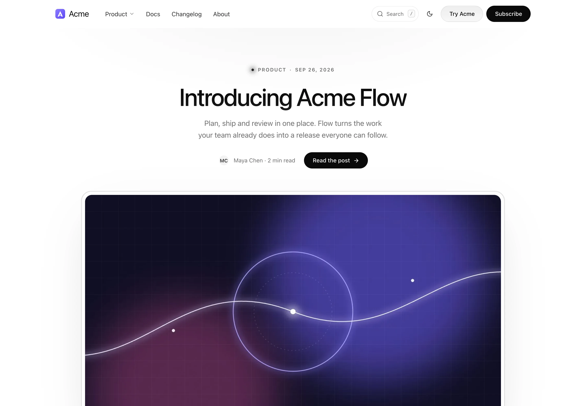
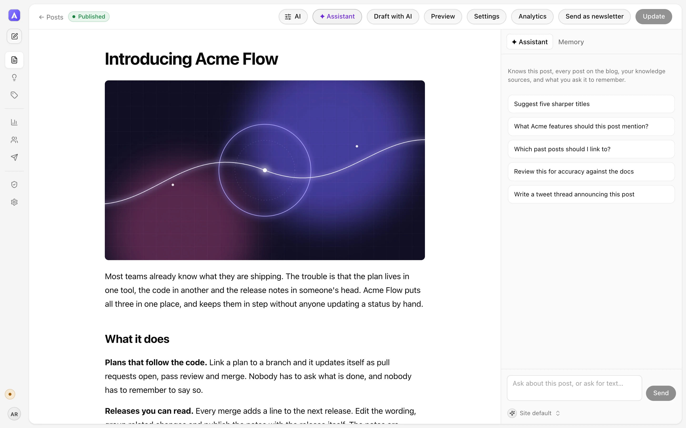
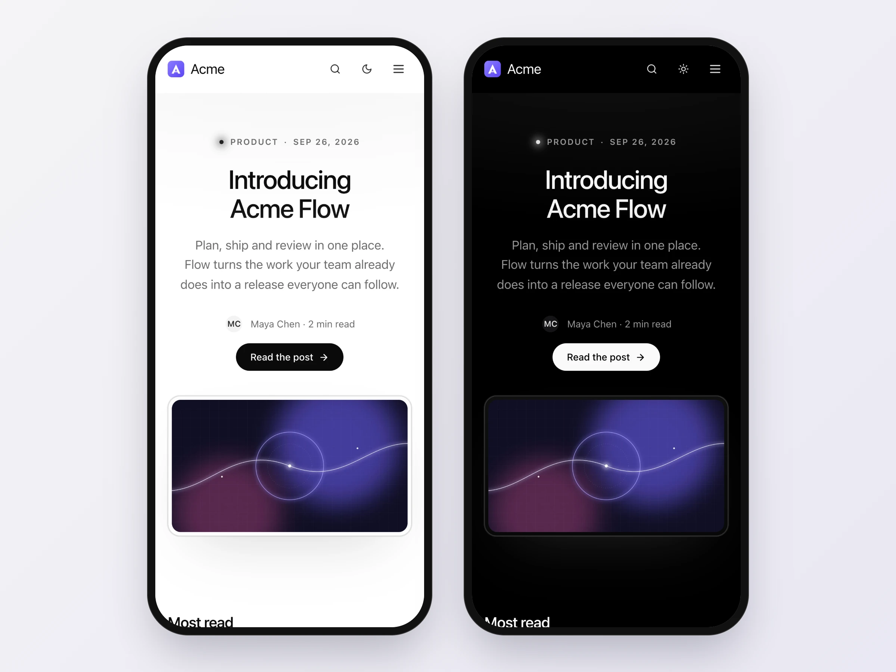

# Masthead

**The AI-native, Ghost-compatible blog and newsletter that runs on Cloudflare Workers, D1 and R2.**

Pages are rendered when you publish and served straight from storage, so readers get a front page that is 21 KB before images and scores 100 in Lighthouse. Writers get a Markdown editor with an AI that knows your blog. Subscribers get double opt-in, one-click unsubscribe and a history that is never overwritten. When you leave Ghost, your URLs, images, members and old unsubscribe links come with you.

[Try it](#try-it-in-two-minutes) · [Deploy](#deploy-to-cloudflare) · [Features](#what-you-get) · [Numbers](#numbers) · [Move from Ghost](docs/ghost.md) · [Configuration](docs/configuration.md) · [Architecture](docs/architecture.md)



## Try it in two minutes

You need [Bun](https://bun.sh) and Node.js 22 or newer (Wrangler runs on it). No Cloudflare account: the Worker, D1 and R2 all run on your machine.

```bash
git clone https://github.com/predotdev/masthead && cd masthead
bun install
bun run dev
```

`bun run dev` builds the admin, writes local secrets to `apps/worker/.dev.vars` and serves the blog at [localhost:8787/blog/](http://localhost:8787/blog/). In a second terminal, load the sample blog:

```bash
bun run seed
```

That is Acme, a fictional company with seven posts, three authors, covers and a newsletter history. Read it at [localhost:8787/blog/](http://localhost:8787/blog/), then write at [localhost:8787/blog/admin/](http://localhost:8787/blog/admin/): choose **Use the owner token** and paste the `BOOTSTRAP_TOKEN` from `apps/worker/.dev.vars`. The first sign-in creates your owner account.

## Deploy to Cloudflare

About ten minutes. You need a Cloudflare account on the Workers Paid plan ($5 a month): the Free plan's 10 ms of CPU per request is too little for publishing.

```bash
cd apps/worker
bunx wrangler login
bunx wrangler d1 create masthead          # prints the database_id
bunx wrangler r2 bucket create masthead
cp wrangler.example.toml wrangler.toml    # paste the database_id; set SITE_URL and EMAIL_FROM
```

`SITE_URL` is the blog's public address, such as `https://example.com/blog/`. No domain yet? Use `https://masthead.<your-subdomain>.workers.dev/blog/`, the address `wrangler deploy` prints, and change it later.

Two secrets are required. Keep them in a file git ignores; `BOOTSTRAP_TOKEN` is your owner token, so save a copy somewhere safe:

```bash
printf 'SECRET=%s\nBOOTSTRAP_TOKEN=%s\n' "$(openssl rand -hex 32)" "$(openssl rand -hex 32)" > .env.production
bun run --cwd ../.. build
bunx wrangler deploy --secrets-file .env.production
```

Open `/blog/admin/` on your Worker, choose **Use the owner token**, and publish your first post. Later deploys are `bun run deploy` from the repository root; secrets stay in place.

Email and AI are one secret each (`RESEND_API_KEY`, `PREDEV_API_KEY`) when you want them. [docs/deploy.md](docs/deploy.md) covers a custom domain, putting the blog under `/blog` on an existing site, email, analytics, switching traffic, health checks and backups.

## What you get

**Fast for readers.** Every page is rendered at publish time and served from R2 with ETags, behind Cloudflare's cache on a custom domain. Nothing on the read path touches the database. Pages work without JavaScript; one 7 KB deferred script adds search, the theme toggle and in-place signup. With Cloudflare Images bound, pictures get WebP copies at the widths the page asks for.

**An editor that writes with you.** Markdown with blocks (images, video, embeds, link cards, callouts, buttons, tables, raw HTML kept byte for byte), a slash menu, drag and drop, autosave, scheduling and version history. The AI rewrites a selection or writes at the cursor, grounded in your published posts, the sources you point it at (docs, `llms.txt`, a changelog) and your house style and team memory, and it cites what it used. An assistant panel sees the whole post. Generate or edit covers and short videos in place, and pick the model for each job from a searchable catalog.



**A newsletter you can trust with a list.** Double opt-in, RFC 8058 one-click unsubscribe on every email, recipients frozen when a send is queued, idempotent batches, one worker at a time per send, and a subscription history where an import or a product signup never re-subscribes someone who opted out. Test mode keeps newsletters inside the team until you turn it off.

**Found by search engines and AI assistants.** Canonical URLs, share cards with real image sizes, BlogPosting and breadcrumb structured data, sitemaps with images, a full-text RSS feed, `llms.txt` and `llms-full.txt`, a Markdown copy of every post, heading anchors and IndexNow pings on publish. Any host other than the canonical one answers with `noindex`, so a staging copy never competes with the real site.

**A theme that looks like your product.** Header menus with described dropdowns, footer columns, search (`/` or ⌘K, and a search page that works without JavaScript), light and dark with no flash, and an optional night-sky backdrop. All of it is settings, edited in the admin or applied from a file.



**Analytics from day one.** Opens, clicks and unsubscribes for every send, subscribers over time and where each signup came from, straight from D1. Connect PostHog and the same page adds visitors, sources, read-through and product signups after reading; connect Search Console and it adds the searches behind every post, with the opportunities worth acting on.

**A studio that suggests what to write.** Point it at your repositories, a changelog or any JSON feed. It proposes posts grounded in real work, keeps names on your denylist out of every prompt and draft, and drafts one in your house style with a click.

**Easy to leave Ghost.** Two commands copy posts, pages, drafts, tags, staff with roles, newsletter settings, members with their full history and every image into your Worker, keeping every URL. Old Ghost unsubscribe links keep working. See [Move from Ghost](docs/ghost.md).

## Numbers

pre.dev's blog, the same 39 posts on both systems, measured on 2026-09-28 with a cold Chrome visit and Lighthouse 12.8.2 on the mobile profile. Masthead is at `pre.dev/blog-new/`; Ghost 6 with its Casper theme is at `pre.dev/blog/`.

| Front page | Masthead | Ghost |
| --- | ---: | ---: |
| Transferred, including images | 242 KB | 2,125 KB |
| JavaScript | 105 KB | 784 KB |
| Requests | 15 | 26 |
| Lighthouse performance / accessibility / best practices | 100 / 100 / 100 | 72 / 95 / 100 |
| Largest contentful paint | 1.1 s | 7.8 s |

Masthead's own script is 7 KB. The other 98 KB is PostHog, which pre.dev turns on and Masthead loads after the page settles; without it the page is about 145 KB. The Acme sample above has no analytics: 73 KB in 12 requests, 21 KB before images, and 100 in all four Lighthouse categories on phone and desktop.

Publishing streams files from the renderer, so memory stays flat as a blog grows. `bun scripts/bench-build.ts <snapshot.json> 1000 10000` repeats a snapshot's posts to 10,000 and renders them the way the server does: on an M2 Max laptop that is about 10 seconds and under 50 MB, well inside a Worker's 128 MB. In a load test, one deployment served about 3,200 requests a second with no errors, without the edge cache.

## How it works

One Worker serves everything under the blog's path. Publishing renders the whole site (pages, feeds, sitemaps, `llms.txt`, Markdown copies and a search index) and writes only the files that changed to R2. Readers are served from R2 without touching D1. The admin is a Preact app served by the same Worker, and a cron trigger each minute publishes scheduled posts, works through newsletter batches and keeps the AI's knowledge current.

| Path under the blog | What it serves |
| --- | --- |
| `/` and every page | the published site, from R2 |
| `content/…` | images and media, with range requests |
| `api/…` | subscribe, confirm, unsubscribe, email webhooks |
| `admin/` | the admin app; `admin/api/…` is its API |

Models, email, where ideas come from and the theme are connectors behind small interfaces in `@masthead/core`. More in [docs/architecture.md](docs/architecture.md).

## Configuration

Everything comes from the Worker's environment: `[vars]` in `wrangler.toml` for plain values, secrets for keys. Only `SITE_URL`, `SECRET`, `BOOTSTRAP_TOKEN` and the D1, R2 and assets bindings are required. Site settings (title, menus, footer, look, house style, AI sources) live in the admin, or in a file you apply with `masthead settings`. The full reference is [docs/configuration.md](docs/configuration.md).

## Connectors

| Kind | Interface | Included |
| --- | --- | --- |
| AI models | `AIProvider`: list models, text (streamed), images, video, embeddings | `@masthead/ai-predev`: hundreds of models on one pre.dev API key |
| Email | `EmailTransport`: send a batch, verify delivery events | `@masthead/email-resend` |
| Content | `ContentSource`: load a snapshot | snapshot files, `@masthead/import-ghost` |
| Studio sources | `Source`: pull signals, expand evidence | `@masthead/source-github`, `@masthead/source-json`, `@masthead/source-predev` |
| Policies | `Policy`: admit, redact, review | `denylist` in `@masthead/core` |
| Static output | `WebTarget`: write files | `@masthead/web-fs` |

Swapping one means implementing a small interface and changing a line in [apps/worker/src/index.ts](apps/worker/src/index.ts).

## Contributing

Issues and pull requests are welcome. [CONTRIBUTING.md](CONTRIBUTING.md) has the setup, the checks CI runs and how to add a connector. Please report security issues privately, as [SECURITY.md](SECURITY.md) describes.

## License

MIT. Made by [pre.dev](https://pre.dev) for its own blog.
