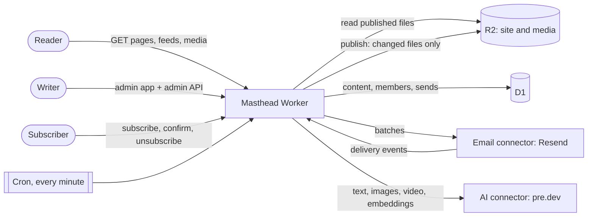

# Architecture

Masthead is a static site that knows how to rebuild itself. A Cloudflare Worker keeps content in D1, renders the whole publication into R2 whenever something changes, and serves readers from R2. Writers, subscribers and the newsletter go through the same Worker.

## Reading

A request for a page maps to a file in R2 (`/blog/some-post/` is `site/blog/some-post/index.html`) and is answered with its ETag and Last-Modified, so repeat visits get `304 Not Modified`. On a custom domain, Cloudflare's cache sits in front. The read path never queries D1: a traffic spike costs R2 reads, not database load. Media under `content/` is served from R2 with range requests, so video seeks, and WebP copies at `srcset` widths are made on first request when the Images binding is present. So are share cards (`content/cards/<key>.png`) for pages without an image: drawn with satori and resvg the first time someone asks, then kept in R2.

Hosts other than `SITE_URL`'s answer with `x-robots-tag: noindex`, so staging and workers.dev copies never compete with the real site. `PREVIEW_PATH` serves the whole site at a second path with links rewritten on the way out, for trying Masthead on a domain whose main path still belongs to another blog.

## Publishing

Publishing renders every file the site needs from what is in D1:

- a page per post, page, tag and author, plus paginated listings and a 404 page,
- the RSS feed, a sitemap index with post, page, tag and author sitemaps (with images),
- `llms.txt`, `llms-full.txt` and a Markdown copy of every post,
- a search index, the theme's stylesheet and script, `_masthead/routes.json` with the redirects a host should apply, and `_masthead/cards.json` listing the share card each page without an image gets.

The renderer (`@masthead/render`) is a generator: files stream out one at a time, and post bodies are loaded fifty at a time, so memory stays flat whether the blog has 40 posts or 10,000. Each file is hashed and compared with the hash recorded in `site_files`; only changed files are written to R2, theme files first so no page names a stylesheet that is not there yet. A typical edit rewrites the post, the listings it appears on and the feeds.

Publishing happens when a post is published, updated or unpublished, when settings change, and each minute for scheduled posts. The same renderer runs outside the Worker too: `masthead build` turns a snapshot into a static site on disk.

## Writing

The admin is a Preact app (`packages/admin`) served by the Worker under `admin/`. Its editor is TipTap with Markdown as the stored format and Ghost-compatible HTML for cards, so imported posts render exactly as they did. Every save keeps a revision.

AI features go through the `AIProvider` connector. Text streams to the browser as server-sent events, and a closed tab stops the work. The editor's AI answers from:

- **knowledge**: published posts and the sources in Settings, split into passages and embedded into the `knowledge` table, with a packed index in R2 for fast search. New posts are embedded after they publish; sources are re-read daily. Each post's vector (the mean of its passages') finds its closest posts, kept in `related_posts` for Keep reading; only posts whose vector changed are compared again, and the next cron tick republishes when the lists change.
- **house style and memory**: the voice in Settings and short facts the team adds, sent with every request.

The studio turns sources (GitHub, JSON feeds, pre.dev projects) into ideas. Policies run between sources and models: the denylist skips signals that name anyone on it, masks those names in evidence before a model reads it, and blocks drafts that still contain one.

## Subscribers and the newsletter

Signing up creates a pending member and sends a confirmation link signed with `SECRET`; clicking it subscribes. Every change is an event in `member_events` with its source (the member, an admin, an API integration, an import or the email provider), and a later import or API call never turns an opt-out back into a subscriber.

Sending a post freezes its recipients into `send_recipients` when the send is queued. The cron works through them in batches, one worker at a time per send (a lease), and every message carries an idempotency key, so a retry never sends twice. Each email has a signed RFC 8058 one-click unsubscribe header. Delivery, open, click, bounce and complaint events come back through a verified webhook; bounces and complaints suppress the address.

## Accounts

Staff sign in with single-use links that expire in an hour; the link opens the admin, and only a click uses it, so mail scanners cannot. Sessions are HttpOnly cookies. API keys for integrations are stored as hashes and carry a role (admin, editor or author). The owner token (`BOOTSTRAP_TOKEN`) is for first setup and the CLI. State-changing admin calls need a bearer token or the admin app's own header, so a cross-site form cannot make them.

## Data

D1 holds everything that is not a file:

| Tables | What they hold |
| --- | --- |
| `posts`, `post_tags`, `post_authors`, `post_revisions`, `tags` | Content and its history |
| `staff`, `sessions`, `login_tokens`, `api_keys` | Accounts and access |
| `members`, `member_events` | The list and every change to it |
| `sends`, `send_recipients`, `email_events` | Newsletters, recipients and delivery events |
| `media`, `site_files` | Stored files with sizes, and the hash of every published file |
| `knowledge`, `related_posts`, `ai_jobs`, `ideas` | What the AI has read and the posts closest in meaning to each post, video jobs, studio ideas |
| `settings`, `analytics_cache` | Site, newsletter and AI settings; cached analytics queries |

Migrations live in `packages/server/src/db.ts` and run on the first request after a deploy, each as one batch that applies completely or not at all.

R2 holds the published site under `site/` and media under `media/content/`, with the same relative paths Ghost used. `ai/` holds the packed vectors, and `cards/` what share cards are made from (fonts, the sky, sized images).

## Repository layout

| Folder | What it is |
| --- | --- |
| `apps/worker` | The deployable Worker: picks the theme and connectors, and holds `wrangler.example.toml`. |
| `packages/server` | Routing, admin API, publishing, members, newsletter, AI routes, analytics, cron work. |
| `packages/render` | Snapshot in, files out: pages, feeds, sitemaps, structured data, `llms.txt`. |
| `packages/theme-default` | The theme: templates, one stylesheet, one small script. |
| `packages/admin` | The admin app and editor. |
| `packages/core` | Content types and the connector interfaces. No vendor code. |
| `packages/cli` | Import from Ghost, push, seed, compare, settings, build, studio. |
| `connectors/*` | AI (pre.dev), email (Resend), Ghost import, studio sources, static output. |
| `examples/demo` | The Acme sample that `bun run seed` loads. |
| `scripts` | Local dev, the smoke test, the publish benchmark and the leak guard. |
